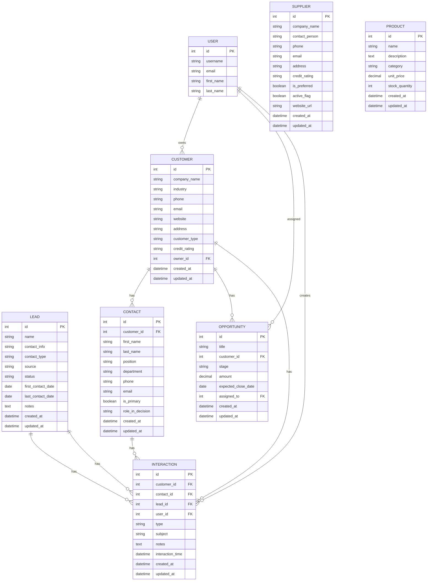

# CRM 系统实体关系图 (ERD)

## 实体关系图

## 表结构说明

### 1. Lead (线索表)
| 字段 | 类型 | 说明 |
|------|------|------|
| id | int | 主键 |
| name | string(100) | 线索姓名 |
| contact_info | string(50) | 联系方式 |
| contact_type | string(20) | 联系方式类型(phone/wechat/email/other) |
| source | string(30) | 线索来源(website/offline_event/referral等) |
| status | string(20) | 状态(pending/contacted/converted/invalid) |
| first_contact_date | date | 首次联系日期 |
| last_contact_date | date | 最后沟通日期 |
| notes | text | 备注 |
| created_at | datetime | 创建时间 |
| updated_at | datetime | 更新时间 |

### 2. Customer (客户表)
| 字段 | 类型 | 说明 |
|------|------|------|
| id | int | 主键 |
| company_name | string(200) | 公司名称 |
| industry | string(100) | 所属行业 |
| phone | string(50) | 公司电话 |
| email | string(254) | 公司邮箱 |
| website | string(200) | 公司网站 |
| address | string(500) | 公司地址 |
| customer_type | string(30) | 客户类型(enterprise/individual/government/organization) |
| credit_rating | string(20) | 信用评级 |
| owner_id | int (FK) | 负责人ID |
| created_at | datetime | 创建时间 |
| updated_at | datetime | 更新时间 |

### 3. Contact (联系人表)
| 字段 | 类型 | 说明 |
|------|------|------|
| id | int | 主键 |
| customer_id | int (FK) | 所属客户ID |
| first_name | string(50) | 名字 |
| last_name | string(50) | 姓氏 |
| position | string(100) | 职位 |
| department | string(100) | 部门 |
| phone | string(50) | 个人电话 |
| email | string(254) | 个人邮箱 |
| is_primary | boolean | 是否为主要联系人 |
| role_in_decision | string(30) | 决策角色(decision_maker/influencer/user等) |
| created_at | datetime | 创建时间 |
| updated_at | datetime | 更新时间 |

### 4. Supplier (供应商表)
| 字段 | 类型 | 说明 |
|------|------|------|
| id | int | 主键 |
| company_name | string(200) | 供应商公司名称 |
| contact_person | string(100) | 主要联系人姓名 |
| phone | string(50) | 联系电话 |
| email | string(254) | 联系邮箱 |
| address | string(500) | 公司地址 |
| credit_rating | string(20) | 信用评级 |
| is_preferred | boolean | 是否为首选供应商 |
| active_flag | boolean | 是否正在合作 |
| website_url | string(200) | 供应商网站 |
| created_at | datetime | 创建时间 |
| updated_at | datetime | 更新时间 |

### 5. Product (产品表)
| 字段 | 类型 | 说明 |
|------|------|------|
| id | int | 主键 |
| name | string(200) | 产品名称 |
| description | text | 产品描述 |
| category | string(100) | 产品类别 |
| unit_price | decimal(12,2) | 标准单价 |
| stock_quantity | int | 库存数量 |
| created_at | datetime | 创建时间 |
| updated_at | datetime | 更新时间 |

### 6. Opportunity (销售机会表)
| 字段 | 类型 | 说明 |
|------|------|------|
| id | int | 主键 |
| title | string(200) | 机会标题 |
| customer_id | int (FK) | 客户ID |
| stage | string(20) | 销售阶段(new_lead/requirement/proposal等) |
| amount | decimal(15,2) | 预计成交金额 |
| expected_close_date | date | 预计成交日期 |
| assigned_to | int (FK) | 负责人ID |
| created_at | datetime | 创建时间 |
| updated_at | datetime | 更新时间 |

### 7. Interaction (互动记录表)
| 字段 | 类型 | 说明 |
|------|------|------|
| id | int | 主键 |
| customer_id | int (FK) | 客户ID(可选) |
| contact_id | int (FK) | 联系人ID(可选) |
| lead_id | int (FK) | 线索ID(可选) |
| user_id | int (FK) | 跟进人ID |
| type | string(20) | 互动类型(phone/email/meeting等) |
| subject | string(200) | 互动主题 |
| notes | text | 沟通内容 |
| interaction_time | datetime | 互动时间 |
| created_at | datetime | 创建时间 |
| updated_at | datetime | 更新时间 |

## 关系说明

1. **Customer - Contact**: 一对多关系，一个客户可以有多个联系人
2. **Customer - Opportunity**: 一对多关系，一个客户可以有多个销售机会
3. **Customer - Interaction**: 一对多关系，一个客户可以有多条互动记录
4. **Contact - Interaction**: 一对多关系，一个联系人可以有多条互动记录
5. **Lead - Interaction**: 一对多关系，一个线索可以有多条互动记录
6. **User - Customer**: 一对多关系，一个用户可以负责多个客户
7. **User - Opportunity**: 一对多关系，一个用户可以负责多个销售机会
8. **User - Interaction**: 一对多关系，一个用户可以创建多条互动记录